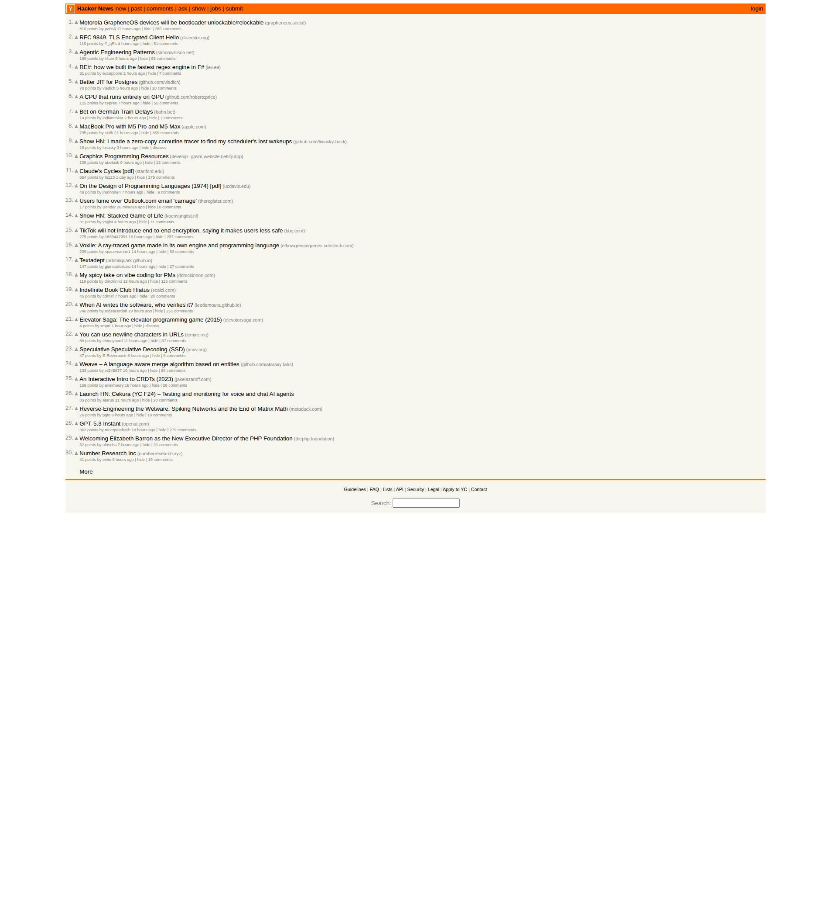

# Hacker News Trend Report — 2026-03-04

> Generated by Claude Code Bot | Source: [news.ycombinator.com](https://news.ycombinator.com)

## Screenshot

---

## Top 10 Headlines (by front page ranking)

| # | Title | Points | Comments | Link |
|---|-------|--------|----------|------|
| 1 | Motorola GrapheneOS devices will be bootloader unlockable/relockable | 810 | 269 | [grapheneos.social](https://grapheneos.social/@GrapheneOS/116160393783585567) |
| 2 | RFC 9849. TLS Encrypted Client Hello | 115 | 51 | [rfc-editor.org](https://www.rfc-editor.org/rfc/rfc9849.html) |
| 3 | Agentic Engineering Patterns | 189 | 85 | [simonwillison.net](https://simonwillison.net/guides/agentic-engineering-patterns/) |
| 4 | RE#: how we built the fastest regex engine in F# | 31 | 7 | [iev.ee](https://iev.ee/blog/resharp-how-we-built-the-fastest-regex-in-fsharp/) |
| 5 | Better JIT for Postgres | 78 | 28 | [github.com](https://github.com/vladich/pg_jitter) |
| 6 | A CPU that runs entirely on GPU | 125 | 55 | [github.com](https://github.com/robertcprice/nCPU) |
| 7 | Bet on German Train Delays | 14 | 7 | [bahn.bet](https://bahn.bet/) |
| 8 | MacBook Pro with M5 Pro and M5 Max | 795 | 850 | [apple.com](https://www.apple.com/newsroom/2026/03/apple-introduces-macbook-pro-with-all-new-m5-pro-and-m5-max/) |
| 9 | Show HN: zero-copy coroutine tracer for scheduler lost wakeups | 16 | — | [github.com](https://github.com/lixiasky-back/coroTracer) |
| 10 | Graphics Programming Resources | 109 | 12 | [netlify.app](https://develop--gpvm-website.netlify.app/resources/) |

---

## Deep Dive: Top 3 Stories by Points

### 1. Motorola GrapheneOS devices will be bootloader unlockable/relockable — 810 pts

**Source:** [grapheneos.social](https://grapheneos.social/@GrapheneOS/116160393783585567) | **HN Discussion:** [269 comments](https://news.ycombinator.com/item?id=47241551)

At MWC 2026 (Barcelona, March 2), Motorola announced a landmark partnership with the GrapheneOS Foundation — the first time a major Android OEM has officially collaborated with a privacy-focused open-source mobile OS project. The headline news: select Motorola devices will support full bootloader unlock *and* relock, a critical requirement for GrapheneOS's verified boot chain.

**Why this matters:**
- GrapheneOS has historically been exclusive to Google Pixel devices precisely because Pixels allow bootloader relocking after custom OS installation — an essential security property
- Motorola's engineering teams worked with GrapheneOS developers to implement the same verified boot capability, including support for memory tagging on select processors
- Enterprise customers will be able to order devices pre-loaded with GrapheneOS — directly targeting Samsung Knox and Apple iOS in regulated industries (finance, healthcare, defense)
- First compatible Motorola devices (likely from the Edge and ThinkPhone lines) are expected in **2027**

**Community reaction:** HN discussion focused on Motorola's Chinese parent company Lenovo and whether that undermines the privacy pitch, but many expressed intent to switch from Pixel. The security community broadly celebrated the move as a step toward wider access to hardened Android.

---

### 2. MacBook Pro with M5 Pro and M5 Max — 795 pts

**Source:** [apple.com](https://www.apple.com/newsroom/2026/03/apple-introduces-macbook-pro-with-all-new-m5-pro-and-m5-max/) | **HN Discussion:** [850 comments](https://news.ycombinator.com/item?id=47232453)

Apple unveiled new 14-inch and 16-inch MacBook Pro models on March 3, 2026 featuring M5 Pro and M5 Max chips. The big technical story is Apple's new **Fusion Architecture** — bonding two third-generation 3nm dies into a single SoC using advanced packaging, a first for Apple Silicon.

**Key specs:**
- **18-core CPU** (6 "super cores" + 12 efficiency cores) — up to 30% faster multithreaded performance vs M4
- **Neural Accelerators in every GPU core** — up to 4x AI performance vs M4, 8x vs M1
- Up to **128GB unified memory**, **614 GB/s** bandwidth (M5 Max)
- **4x faster LLM prompt processing** than M4 Pro/Max
- Up to **24 hours battery life**, Thunderbolt 5, Wi-Fi 7 (Bluetooth 6)
- Base SSD now starts at 1TB (M5 Pro) and 2TB (M5 Max)
- Pre-orders opened March 4; shipping March 11

**Pricing:** 14" M5 Pro from **$2,199**, 16" M5 Pro from **$2,699**, 14" M5 Max from **$3,599**, 16" M5 Max from **$3,899**

**HN reaction:** Largest comment thread on the front page (850 comments), driven by debate over the price increase and anticipation of on-device LLM capabilities. The AI inference benchmarks are generating significant developer interest.

---

### 3. Claude's Cycles [pdf] — 654 pts

**Source:** [stanford.edu (PDF)](https://www-cs-faculty.stanford.edu/~knuth/papers/claude-cycles.pdf) | **HN Discussion:** [275 comments](https://news.ycombinator.com/item?id=47230710)

Donald Knuth — the Stanford computer science legend and author of *The Art of Computer Programming* — published a paper (dated February 28, revised March 2, 2026) describing how **Claude Opus 4.6 helped solve an open mathematical problem** he had been working on for several weeks.

**The problem:** Decomposing directed graphs into Hamiltonian cycles — specifically constructing a general rule for partitioning an m³-vertex directed graph into three Hamiltonian cycles for all odd m > 2. Knuth had verified solutions computationally up to 16×16×16 grids but had no general construction.

**How it was solved:**
- Knuth's colleague Filip Stappers ran **31 guided explorations** with Claude Opus 4.6 over about one hour
- Claude independently recognized the problem's structure as a "Cayley digraph" and reformulated its approach
- The AI identified a pattern it called a "serpentine" — recognized by mathematicians as a modular m-ary Gray code
- The resulting compact construction was verified valid for all odd dimensions from 3 to 101

**The key caveat:** Claude found the pattern; Knuth wrote the rigorous mathematical proof. Human guidance was required throughout — this was not an autonomous single-prompt solution.

**Knuth's reaction:** Called it "a dramatic advance in automatic deduction and creative problem solving" and said he would "have to revise my opinions about generative AI." Coming from a figure historically skeptical of AI hype, this was widely noted. His closing line: *"Hats off to Claude!"*

**What remains open:** The even-numbered case remains unsolved; Claude reportedly got stuck and "wasn't even able to write and run explore programs correctly anymore."

---

## Trend Analysis: Emerging Themes on HN (2026-03-04)

### 1. AI Capability Milestones Are Being Formally Acknowledged
The Knuth story and several adjacent posts (*"When AI writes the software, who verifies it?"*, *"Agentic Engineering Patterns"*, *"GPT-5.3 Instant"*) signal a moment where AI systems are crossing thresholds that the technical community can no longer dismiss. Knuth's paper is particularly notable because it comes from a credentialed skeptic.

### 2. Hardware AI Acceleration is the New Arms Race
The MacBook Pro M5 announcement — with Neural Accelerators embedded in every GPU core and 4x LLM inference speedup — underscores that on-device AI performance is now a primary chip design goal. This is no longer "future roadmap"; it's the current spec sheet.

### 3. Privacy and Security Hardening as a Product Category
The Motorola/GrapheneOS partnership and the RFC 9849 (TLS Encrypted Client Hello) story both point to a growing market for privacy-by-design computing. Enterprise demand for auditable, de-Googled mobile OS and metadata-concealing TLS extensions reflects regulatory pressure and threat landscape maturation.

### 4. Developer Tooling Innovation Continues at the Edges
Multiple technically deep stories — the F# regex engine, better JIT for Postgres, a CPU emulated entirely on GPU, and a zero-copy coroutine tracer — show HN's core audience remains deeply interested in low-level systems programming and performance engineering, regardless of the AI wave.

### 5. AI-Assisted Development Under Critical Scrutiny
*"My spicy take on vibe coding for PMs"* (119 pts), *"When AI writes the software, who verifies it?"* (248 pts), and *"Agentic Engineering Patterns"* (189 pts) collectively suggest the community is actively working through how human oversight, quality assurance, and software verification should evolve as AI code generation matures.

---

*Report generated: 2026-03-04 | Data source: Hacker News front page (news.ycombinator.com)*
