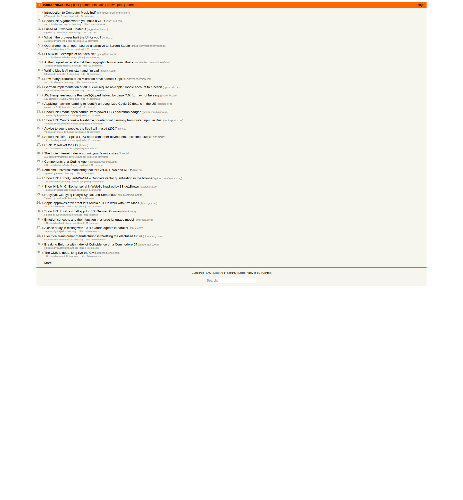

# Hacker News Trend Report — 2026-04-05

> Generated by Claude Code Bot via Chrome DevTools MCP  
> Source: [https://news.ycombinator.com](https://news.ycombinator.com)

---

## Screenshot Reference

---

## Top 10 Headlines

| Rank | Title | Points | Comments | Link |
|------|-------|--------|----------|------|
| 1 | Introduction to Computer Music [pdf] | 87 | 24 | [composerprogrammer.com](https://composerprogrammer.com/introductiontocomputermusic.pdf) |
| 2 | Show HN: A game where you build a GPU | 595 | 144 | [jaso1024.com/mvidia](https://jaso1024.com/mvidia/) |
| 3 | I used AI. It worked. I hated it | 6 | 0 | [taggart-tech.com](https://taggart-tech.com/reckoning/) |
| 4 | What if the browser built the UI for you? | 15 | 12 | [jonno.nz](https://jonno.nz/posts/what-if-your-browser-built-the-ui-for-you/) |
| 5 | OpenScreen – open-source alternative to Screen Studio | 170 | 28 | [github.com/siddharthvaddem](https://github.com/siddharthvaddem/openscreen) |
| 6 | LLM Wiki – example of an "idea file" (Karpathy) | 120 | 30 | [gist.github.com/karpathy](https://gist.github.com/karpathy/442a6bf555914893e9891c11519de94f) |
| 7 | AI that copied musical artist files copyright claim against that artist | 36 | 11 | [twitter.com](https://twitter.com/VladTheInflator/status/2039577001531768906) |
| 8 | Writing Lisp is AI resistant and I'm sad | 53 | 42 | [djhaskin.com](https://blog.djhaskin.com/blog/writing-lisp-is-ai-resistant-and-im-sad/) |
| 9 | How many products does Microsoft have named 'Copilot'? | 505 | 250 | [teybannerman.com](https://teybannerman.com/strategy/2026/03/31/how-many-microsoft-copilot-are-there.html) |
| 10 | German eIDAS will require an Apple/Google account to function | 61 | 47 | [opencode.de](https://bmi.usercontent.opencode.de/eudi-wallet/wallet-development-documentation-public/latest/architecture-concept/06-mobile-devices/02-mdvm/) |

---

## Deep Dive: Top 3 Stories

### 1. Introduction to Computer Music [pdf]
**87 points · 24 comments · composerprogrammer.com**

Nick Collins' *Introduction to Computer Music* is a comprehensive undergraduate textbook originally published by Wiley in 2009. In March 2025, the rights reverted to Collins, who subsequently made the entire book **freely available as a PDF** on his personal website. This is a foundational text covering both the practical use of music technology and the theoretical principles behind computer music composition, synthesis, and programming.

The resurfacing on HN reflects the community's enduring appreciation for open-access educational resources in technical domains — especially when authoritative textbooks covering niche intersections (music + programming) become free. The book is also supported by SuperCollider code examples, making it highly practical for developers exploring creative coding.

**Why it matters:** A premier academic text going open-access is a significant event in the computer music community. It reduces the barrier for developers who want to explore audio synthesis, algorithmic composition, and digital signal processing.

---

### 2. Show HN: A game where you build a GPU
**595 points · 144 comments · jaso1024.com/mvidia**

A solo developer (Jaso1024) built an interactive browser game called **Mvidia** that simulates designing and building a GPU from scratch. Players work through stages of GPU architecture — from transistors and logic gates up to shader pipelines and memory buses. The project is a creative educational tool that turns the notoriously opaque world of GPU hardware design into an accessible, gamified experience.

With 595 points and 144 comments, this is the most-engaged story on the front page. HN's audience responded strongly because:
- It touches on GPU architecture at a moment when GPUs are culturally prominent due to AI workloads
- It's a solo "Show HN" project — the kind of ambitious creative project that HN celebrates
- The name "Mvidia" is a playful nod to NVIDIA

**Why it matters:** This sits at the intersection of hardware education and game design. As GPUs become more central to AI/ML infrastructure, understanding their architecture has real value — this project makes it approachable.

---

### 3. I used AI. It worked. I hated it
**6 points · 0 comments (new) · taggart-tech.com**

Written by an **AI security expert** who describes themselves as "as anti-genAI as it gets," this essay is a candid first-person account of using AI coding assistance to complete a real project: a webhook interceptor that generated PDF certificates with QR codes for course completions. The project *worked* — but the author hated the process deeply.

Key insights from the piece:
- "Human in the loop" sounds good but becomes stultifying in practice — the loop encourages humans to remove themselves from it
- Most time was spent reading AI-proposed code changes and accepting them, rather than *understanding* them
- The author sees this as "straight up dangerous" for a security professional who must reason deeply about code

This story represents a growing genre of **AI disillusionment from technical practitioners** — different from non-technical skepticism because it acknowledges AI *works* while questioning whether the workflow is healthy or safe.

**Why it matters:** The tension between productivity and comprehension is one of the defining debates in software development right now. The voice of a security professional adds weight: if code reviewers stop understanding the code they approve, security audits become theater.

---

## Trend Analysis

### Themes Emerging from Today's Front Page

**1. AI Ambivalence is Mainstream (Multiple Stories)**
Stories #3, #7, and #8 all circle the same axis: *AI works but creates new problems*. Story #7 (an AI that trained on an artist's work then filed a copyright claim against them) is a darkly ironic real-world incident. Story #8 (Lisp as "AI-resistant") notes that AI tools struggle with less-mainstream programming languages. Story #3 is a practitioner's honest reckoning. The HN community is past the hype cycle and into nuanced critique.

**2. GPU Culture is Exploding**
Stories #2 (build a GPU game), #5 (OpenScreen recording tool), and other entries about GPU monitoring tools reflect the unprecedented cultural salience of GPU hardware. As LLM training and inference become household topics, curiosity about the underlying hardware has spiked dramatically.

**3. Open Source vs. Paid Incumbents**
Story #5 (OpenScreen as a free alternative to the paid Screen Studio) continues HN's perennial open-source enthusiasm. The strong engagement (170 pts) signals that developer tooling remains a fertile area for open-source disruption.

**4. Platform Lock-in Backlash**
Story #10 (Germany's eIDAS digital wallet requiring Apple/Google accounts) and Story #9 (Microsoft's proliferating "Copilot" brand confusion) both touch on the tension between big-platform control and open digital infrastructure. European digital sovereignty concerns and Microsoft brand fatigue are converging themes.

**5. LLM Knowledge Tooling (Karpathy's Idea File)**
Story #6, Andrej Karpathy's "LLM Wiki" idea-file concept, points to a maturing discourse around personal knowledge management augmented by LLMs. The community is moving from "LLMs can answer questions" to "how do we structure knowledge *for* LLMs?"

**6. Open Access Education**
Story #1 (free computer music textbook) alongside the general Show HN energy reflects HN's consistent appreciation for democratizing technical knowledge — especially when it comes from practitioners making their work freely available.

---

*Report generated: 2026-04-05 | Data source: Hacker News front page | Screenshot: `hn-screenshot-2026-04-05.png`*
